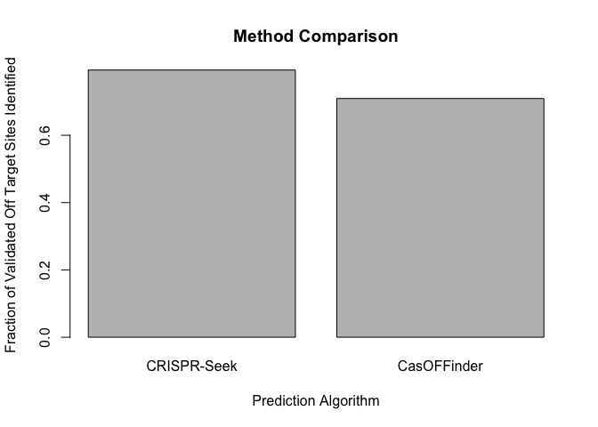

2.1 Identifying off target CRISPR sites
------------------

Table of Contents
-----------------------

**Contributors**
 -Writing: Ramya
 -Coding: Jay
 -Pipeline: Daniel

### Introduction: CRISPR/Cas in the Context of Genome Editing
Since the discovery of its versatile genome editing function in 2013, the CRISPR/Cas system has been heavily studied for its use in targeted genome modification in eukaryotic cells. In many current applications, the Cas9 endonuclease from Streptococcus pyogenes is directed by a synthetic single stranded guide RNA (gRNA) containing homology to a genomic region. The gRNA displaces the duplex DNA and forms its own RNA:DNA duplex with one of the DNA strands. Cas9 then cleaves both strands of the DNA, inducing native DNA repair pathways. At this point, if a retinue of mutations at the site is the end goal, non-homologous end joining occurs with indels. However, if a specific point mutation or sequence insert is the goal, the addition of excess double stranded DNA of interest will result in a small population of recombinants with the change after Cas9 action.
 

### Writing:

#### Off-Target Effects and “Determinants of CRISPR/Cas sgRNA Specificity” (1)
The sheer size of the human genome often means that the gRNA target sequence is at least partially homologous to several locations in the genome. This binding of gRNAs to unintended genomic sequences is referred to as off-target effects. Even with the careful design of gRNAs, off-target binding is high and gRNA dependent – between 10-1300 off target binding events were observed in one study with 12 different gRNAs (2). Currently, off-target effects are one of the primary set backs for clinical application of CRISPR/Cas9. However, there are several mechanisms that confer specificity to the CRISPR/Cas9 system that can be leveraged to reduce off-target effects.

*PAM site:*

As shown in orange in the figure above, the protospacer adjacent motif, or PAM site, is a 3 base pair sequence expected to bind the 3’ end of the designed gRNA. It has been shown to be absolutely required in the genome to target Cas9, as it is at the 5’ end of the PAM site that Cas9 introduces a double stranded break into the DNA. About 50% of the time in humans, the PAM sequence is the GGG motif, though NGG is also seen (2).  Depending on the origin species of the Cas9 employed, different PAM motifs can be probed. 

*gRNA & PAM Proximal versus PAM Distal*

The gRNA consists of two main elements: a scaffolding piece to bind Cas9 and a target piece complementary to a region in the genome. The designed gRNA is often about 20 nucleotides long. While intuition suggests that longer sequences may confer higher specificity, this was proven wrong (1). Free single stranded RNA is highly unstable, and it is thought that Cas9 protects only about 20 nucleotides from degradation.

The PAM proximal region of gRNA is that which is closest to the PAM site while the PAM distal gRNA region is farther from the site. In a genome-wide ChIP-seq experiment using 12 gRNAs to characterize their off-target binding preferences, near-perfect homology of gRNA to DNA was observed at the PAM-proximal region (2). On the other hand, the PAM distal region had up to 10 mismatches with the genomic DNA (2). The PAM proximal region is referred to as the seed sequence to ensure gRNA specificity. The exact number of bases for this region is heavily debated but ranges between 1-12 nucleotides (1)(2)(3). 

While the target sequence is very important, some studies have shown that the scaffolding piece of the gRNA is also critical. Both lengthening and shortening the 3' end of the gRNA was shown to reduce gRNA expression (1). Still another group showed that lengthening the hairpin region tethering the gRNA to Cas9 can improve stability and target specificity of the complex (1). 

The gRNA is the most important determinant of Cas9 specificity. The exact mechanism by which gRNA confers this specificity is not well understood. Some potential mechanisms include changing “the thermodynamic stability of the gRNA:DNA duplex,” the effective concentration of Cas9-gRNA (higher = less specific), the blocking of other Cas9 sites for trans-acting binding proteins, and the conformation of Cas9 to better access chromatin (1). 

*Chromatin Structure and Methylation:*

DNA exists as tightly compacted coils around histone proteins in human cells, and this results in bulky, complex structures that can sometimes impede protein-DNA interaction. Thus, gRNA binding is heavily biased towards binding more accessible regions of the genome. One study showed that over 50% of gRNA binding is in open chromatin regions (2). Less accessible chromatin regions also correspond to higher CpG methylation. The presence of these marks has been suggested to block Cas9 binding (1)(3).

*Cas9 related factors:*

Because of the fast action of Cas9 and rapid degradation, the addition of purified Cas9 is reported to help reduce off-target effects (3). Furthermore, Cas9 can be modified into a nickase, such that it only cuts one DNA strand and a pair of gRNAs and nickases can be used for greater stringency in mutation (4).

#### The Inputs Required for Off-Target-Effect analysis of gRNAs
For off-target analysis, most tools simply require the gRNA sequence and a genome to search. gRNA specific parameters can either be inputs or set by the program such as tolerated mismatches, length, etc. Some tools also allow the specification of PAM site based on the Cas9 ortholog used. More advanced tools allow for the inclusion of ENCODE data, specifying chromatin structure across the genome to account for this as well.

#### Comparison of *De novo* tool and Other Prediction tools such as: CRISPR Seek and Cas OFFinder
For more detailed information about Jay's tool and other prediction tools, see the Coding and Pipeline sections. 

From my research, it appears that Jay's tool shows more promise than Cas OFFfinder which Daniel used on a separate genome to test the tool's ability to predict off-target binding sites. CasOFFinder only looks for PAM sequences and gRNA mismatches to PAM regions (5). There is no incorporation of PAM-proximal preference. One of the advantages of CasOFFinder is lower memory usage because it divides the genome into smaller chunks for searching and comparing (5).

CRISPR Seek does allow more user manipulation of the running parameters. Similar to defining the PAM-proximal regions as more important, CRISPR Seek allows the user to specify which nucleotides in the gRNA must be totally homologous to the genome (6). Furthermore, CRISPR Seek is compatible with Cas9 nickase experiments with 2 gRNAs and allows for optimization of such a system (6). However, when it comes time to pick off-target sites, again only mismatch number and PAM sequence parameters are used (6).

It is very difficult to include the full range of information discussed above into any one algorithm as it is always changing, and not true for all gRNAs. The next steps for Jay's algorithm include the incorporation of ENCODE ChIP-seq data for chromatin structure, the weighted search of PAM sites accounting for their natural frequency, and Cas9 nickase experiment compatibility. 

### Coding:

#### Documentation: *De novo* Off-Target Mutation Prediction Tool for SubjectZ
The following is a basic overview of Jay's code.

The *de novo* tool developed by Jay accounts for many of the same factors as other publicly available off-target binding prediction tools. Through the Hamming Distance parameter, the number of tolerated mismatched bases can be specified. The chosen value was 7. The increased importance of the PAM proxmial region of the gRNA is also taken into account when searching for homologous genome regions through the Minkowski seed region weighting. While all currently hard-coded, the length (3 nucleotides) and sequence of the PAM site (NGG) can be user defined, as well as the length of the gRNA (20 nucleotides).
#### Results:

### Pipeline:

Here we examine the results of two CRISPR off-target prediction tools,
CRISPR-Seek (Zhu et al 2014) and Cas OFFinder (Bae et al 2014). These
methods were compared in Haeussler et al (2016). CRISPR Seek utilizes an
empirically derived substitution matrix to score the likelihood that
sites will be cleaved by the Cas9 nuclease given similarity to the guide
(with the substitution matrix quantifying mismatch penalties). Cas
OFFinder searches the genome for patterns indicative of PAM sites, and
scores putative sites based on base mismatches against the guide query.
The following analysis compares the performance of these methods against
the human reference genome (build 38), and compare against the
benchmarking results from Haussler et al (2016).

#### Documentation:

# load libraries
    library(tidyr)
    library(dplyr)

    ## 
    ## Attaching package: 'dplyr'

    ## The following objects are masked from 'package:stats':
    ## 
    ##     filter, lag

    ## The following objects are masked from 'package:base':
    ## 
    ##     intersect, setdiff, setequal, union

    library(reshape2)

    ## 
    ## Attaching package: 'reshape2'

    ## The following object is masked from 'package:tidyr':
    ## 
    ##     smiths

    library(CRISPRseek)

    ## Warning: package 'CRISPRseek' was built under R version 3.3.3

    ## Loading required package: BiocGenerics

    ## Loading required package: parallel

    ## 
    ## Attaching package: 'BiocGenerics'

    ## The following objects are masked from 'package:parallel':
    ## 
    ##     clusterApply, clusterApplyLB, clusterCall, clusterEvalQ,
    ##     clusterExport, clusterMap, parApply, parCapply, parLapply,
    ##     parLapplyLB, parRapply, parSapply, parSapplyLB

    ## The following objects are masked from 'package:dplyr':
    ## 
    ##     combine, intersect, setdiff, union

    ## The following objects are masked from 'package:stats':
    ## 
    ##     IQR, mad, xtabs

    ## The following objects are masked from 'package:base':
    ## 
    ##     anyDuplicated, append, as.data.frame, cbind, colnames,
    ##     do.call, duplicated, eval, evalq, Filter, Find, get, grep,
    ##     grepl, intersect, is.unsorted, lapply, lengths, Map, mapply,
    ##     match, mget, order, paste, pmax, pmax.int, pmin, pmin.int,
    ##     Position, rank, rbind, Reduce, rownames, sapply, setdiff,
    ##     sort, table, tapply, union, unique, unsplit, which, which.max,
    ##     which.min

    ## Loading required package: Biostrings

    ## Loading required package: S4Vectors

    ## Warning: package 'S4Vectors' was built under R version 3.3.3

    ## Loading required package: stats4

    ## 
    ## Attaching package: 'S4Vectors'

    ## The following objects are masked from 'package:dplyr':
    ## 
    ##     first, rename

    ## The following object is masked from 'package:tidyr':
    ## 
    ##     expand

    ## The following objects are masked from 'package:base':
    ## 
    ##     colMeans, colSums, expand.grid, rowMeans, rowSums

    ## Loading required package: IRanges

    ## Warning: package 'IRanges' was built under R version 3.3.3

    ## 
    ## Attaching package: 'IRanges'

    ## The following objects are masked from 'package:dplyr':
    ## 
    ##     collapse, desc, regroup, slice

    ## Loading required package: XVector

    ## Warning: package 'XVector' was built under R version 3.3.3

    library(BSgenome.Hsapiens.UCSC.hg19)

    ## Loading required package: BSgenome

    ## Loading required package: GenomeInfoDb

    ## Loading required package: GenomicRanges

    ## Warning: package 'GenomicRanges' was built under R version 3.3.3

    ## Loading required package: rtracklayer

    library(TxDb.Hsapiens.UCSC.hg19.knownGene)

    ## Loading required package: GenomicFeatures

    ## Warning: package 'GenomicFeatures' was built under R version 3.3.3

    ## Loading required package: AnnotationDbi

    ## Loading required package: Biobase

    ## Welcome to Bioconductor
    ## 
    ##     Vignettes contain introductory material; view with
    ##     'browseVignettes()'. To cite Bioconductor, see
    ##     'citation("Biobase")', and for packages 'citation("pkgname")'.

    ## 
    ## Attaching package: 'AnnotationDbi'

    ## The following object is masked from 'package:dplyr':
    ## 
    ##     select

    library(org.Hs.eg.db)

    ## 

We began by pulling 31 guide RNAs and 650 experimentally validated off
target sites from the supplemental data of Haussler et al (2016). The
guides were then be fed into CRISPR-Seek and CasOFFinder to generate
predicted off target sites. These predictions were compared against the
validated set to assess each method's performance.

    # LOAD IN THE GUIDE RNAS AND VALIDATED OFF TARGET SITES FROM THE PAPER
    df <- read.table('~/Downloads/13059_2016_1012_MOESM2_ESM.tsv', sep='\t', header=TRUE, stringsAsFactors = FALSE)
    # there are 31 unique guide RNAs
    # length(unique(df$guideSeq))

    # 650 unique off targets
    # length(unique(df$otSeq))

    # extract guides and off target sequences
    guides <- unlist(substr(unique(df$guideSeq),1,20))
    offTarget <- unique(df[,c('guideSeq','otSeq')])

    # write guide RNAs to file for usage in off target tools
    seqNames <- 1:length(guides)
    seqNames <- paste0('>', seqNames)
    outFile <- paste(seqNames, guides, '', sep='\n')
    write(outFile, '~/Desktop/gRNA.fasta')

#### Results:

Here we see that CRISPR-Seek predicts 496 sequences which are present in
the validated dataset. Checking for the reverse compliment of
CRISPR-Seek prediction increases this number to 516. \#\# CRISPR-Seek

    # GENERATE LIST OF OFF TARGET SITES FROM CRISPRSEEK
    # results <- offTargetAnalysis(inputFilePath = '~/Desktop/gRNA.fasta', findgRNAsWithREcutOnly = FALSE, findPairedgRNAOnly = FALSE, findgRNAs = FALSE, BSgenomeName = Hsapiens, txdb = TxDb.Hsapiens.UCSC.hg38.knownGene, orgAnn = org.Hs.egSYMBOL, max.mismatch = 4, outputDir = '~/Desktop/', overwrite = TRUE)

    # READ IN RESULTS FROM CRISPRSEEK
    CRISPRSEEK <- read.table('~/Desktop/OfftargetAnalysis.xls', sep='\t', header=TRUE, stringsAsFactors = FALSE)
    list1 <- CRISPRSEEK[,c('OffTargetSequence')]
    Rlist1 <- DNAStringSet(list1)
    Rlist1 <- Biostrings::reverseComplement(Rlist1)
    Rlist1 <- unlist(lapply(Rlist1,toString))

    # Check the number of off targets predicted by CRISPR Seek that are in the validated dataset

    sum(list1 %in% offTarget$otSeq)

    ## [1] 496

    sum(list1 %in% offTarget$otSeq) + sum(Rlist1 %in% offTarget$otSeq)

    ## [1] 516

CasOFFinder predicts 461 of the 650 validated off target sites. \#\#
CasOFFinder

    # GENERATE LIST USING CASOFFINDER (www.rgenome.net/cas-offinder)
    # this was done using their online tool because R integration is not supported

    # READ IN CAS-OFFINDER results
    CASOFF <- read.table('~/Dropbox/result.txt', sep='\t', header=FALSE)
    CASOFF_offtargets <- toupper(CASOFF[,3])
    RCASOFF_offtargets <- DNAStringSet(CASOFF_offtargets)
    RCASOFF_offtargets <- Biostrings::reverseComplement(RCASOFF_offtargets)
    RCASOFF_offtargets <- unlist(lapply(RCASOFF_offtargets,toString))

    # Check the number of off targets predicted by CAS-OFFinder that are in the validated dataset
    length(intersect(CASOFF_offtargets,offTarget$otSeq))

    ## [1] 441

    length(intersect(RCASOFF_offtargets,offTarget$otSeq))+ length(intersect(CASOFF_offtargets,offTarget$otSeq))

    ## [1] 461

Comparison against published analyses
-------------------------------------

The authors of the multi-tool analysis report that CasOFFinder finds all
validated off target sites. Though we ran the tool with the same
tolerance of up to 4 mismatches, we did not recover all validated sites.
This may be because we ran our prediction against one version of the
genome, while the curated list of validated off-target sites come from
numerous genome versions across several studies. CRISPR-Seek does
slightly better with a total of 516 identified sites, but likely suffers
from the same limitation (though the authors do not explicitly test the
performance of this tool)

#### Conclusions:

Our pipeline shows similar performance of CRISPR-Seek and CasOFFinder in predicting
validated off target sites from 31 guide RNAs. Discrepancies between our work and
that published in Haeussler et al likely step from differences in target genomes.

Citations
---------

1.Zhu, L. J., Holmes, B. R., Aronin, N. & Brodsky, M. H. CRISPRseek: A
Bioconductor Package to Identify Target-Specific Guide RNAs for
CRISPR-Cas9 Genome-Editing Systems. PLoS One 9, (2014). 
2.Bae, S., Park, J. & Kim, J.-S. Cas-OFFinder: a fast and versatile algorithm that
searches for potential off-target sites of Cas9 RNA-guided
endonucleases. Bioinformatics 30, 1473–1475 (2014). 
3.Haeussler, M. et al. Evaluation of off-target and on-target scoring algorithms and
integration into the guide RNA selection tool CRISPOR. Genome Biol. 17,
148 (2016).

#### References:

 References can be included here or at the end of each relevant section.
 
 
